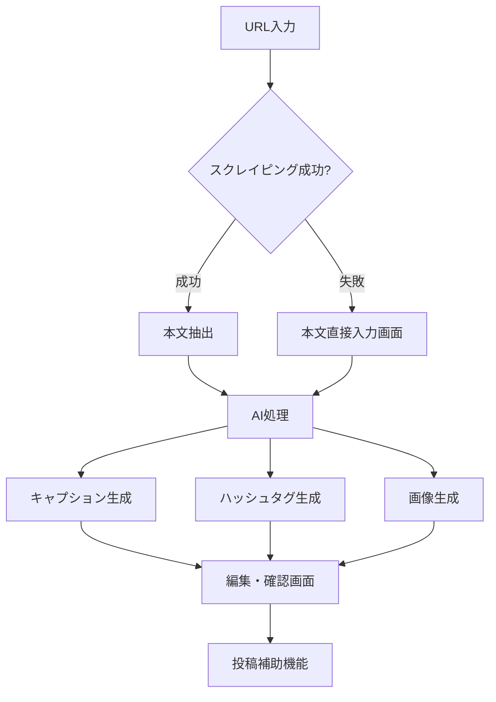

# Instagram 投稿素材自動生成サービス MVP 要件定義書

## 1. サービス概要

### 1.1 基本情報

- **サービス名**: Instagram 投稿素材自動生成サービス（仮）
- **開発形態**: 個人開発（Claude Code 使用）
- **MVP 期間**: 約 4 週間
- **想定リリース**: クローズドベータ版

### 1.2 コンセプト

「ブログ記事の URL を入れるだけで、Instagram 投稿用のキャプション・ハッシュタグ・画像を自動生成」

ブロガーやライターが記事を書いた後、Instagram で記事を紹介する手間を最小化。キャプション作成・ハッシュタグ選定・画像生成の 3 ステップを AI が代行する。

### 1.3 ターゲットユーザー

- **プライマリ**: 個人ブロガー、フリーライター
- **セカンダリ**: note ユーザー、WordPress ユーザー
- **将来展開**: 企業メディア担当者

## 2. ビジネスモデル

### 2.1 収益化フェーズ

```
Phase 1 (MVP): クローズドベータ版
├── 特定ユーザーのみ無料提供
├── フィードバック収集重視
└── 回数制限: Cookie管理（1日5回まで）

Phase 2: 一般公開版
├── 無料プラン: 月5回まで
└── 有料プラン: 月額500-1000円で無制限使用
```

### 2.2 差別化ポイント

- ブログ記事特化の最適化
- シンプルでビジネス寄りのトーン
- 日本語ハッシュタグの適切な生成
- 投稿補助機能による手間削減

## 3. 機能要件

### 3.1 コア機能フロー



### 3.2 機能詳細

#### 3.2.1 URL 入力・本文抽出

- **入力**: ブログ記事の URL
- **処理**: @mozilla/readability + jsdom で本文抽出
- **フォールバック**: スクレイピング失敗時は本文コピペ画面へ
- **文字数制限**: コピペ時は最大 10,000 文字

#### 3.2.2 AI 要約・キャプション生成

- **使用 API**: OpenAI API（GPT-4）
- **生成内容**:
  - 記事タイトル（短縮版）
  - 要約文（1-2 行、100-150 文字）
  - トーン: シンプル・ビジネス寄り（絵文字なし）
- **編集機能**: 生成後にユーザーが編集可能
- **文字数カウンター**: リアルタイム表示

#### 3.2.3 ハッシュタグ生成

- **生成数**: 10 個（内容関連 8 個 + 汎用 2 個）
- **言語**: 日本語中心
- **選択 UI**: チェックボックスで選択/非選択
- **デフォルト**: 全選択状態

#### 3.2.4 画像生成

- **技術**: @vercel/og（または Canvas API）
- **サイズ**: 1080×1080px（正方形）
- **デザイン**:
  - 背景: 単色（3 色からランダム）
    - #1E293B（ダークネイビー）
    - #334155（グレー）
    - #F5F5F5（ライトグレー）
  - テキスト: 白または黒（背景色に応じて自動選択）
  - フォント: Noto Sans JP
- **編集**: 不可（気に入らない場合は自分の画像使用を推奨）

#### 3.2.5 投稿補助機能

- **Step 1**: 画像自動ダウンロード
- **Step 2**: キャプション＋ハッシュタグをクリップボードにコピー
- **Step 3**: デバイスに応じて Instagram 誘導
  - モバイル: Instagram アプリを開く（instagram://camera）
  - PC: Instagram Web を新規タブで開く
- **ガイド表示**: 投稿手順を画面に表示

### 3.3 非機能要件

#### 3.3.1 パフォーマンス

- 生成処理: 最大 30 秒でタイムアウト
- 画像生成: 3 秒以内
- レスポンス目標: 全体で 1 分以内に完了

#### 3.3.2 エラーハンドリング

```
URL入力ミス → 「有効なURLを入力してください」
スクレイピング失敗 → 本文コピペ画面へ自動遷移
API失敗 → リトライボタン表示（最大3回）
タイムアウト → 「処理に時間がかかっています」→ リトライ促す
```

#### 3.3.3 セキュリティ・制限

- 認証: なし（誰でもアクセス可能）
- 回数制限: Cookie 管理（1 日 5 回）
- API 利用上限: 月額 1,000 円まで（開発者負担）

## 4. UI/UX デザイン

### 4.1 デザインコンセプト

- **スタイル**: モダン＆シック
- **参考**: Notion / Linear / Vercel
- **特徴**: 余白多め、落ち着いた配色

### 4.2 カラーパレット

```
Primary: #3B82F6（ブルー）
Background: #FFFFFF（ホワイト）
Text Primary: #1F2937（ダークグレー）
Text Secondary: #6B7280（グレー）
Border: #E5E7EB（ライトグレー）
Success: #10B981（グリーン）
Error: #EF4444（レッド）
```

### 4.3 フォント

- 日本語: Noto Sans JP
- 英数字: Inter

### 4.4 画面構成

#### 4.4.1 トップ画面

```
┌──────────────────────────────────┐
│ [ロゴ] Instagram Post Generator  │
│                                  │
│   ブログ記事から投稿素材を自動生成     │
│                                  │
│  ┌────────────────────────────┐  │
│  │ URLを入力...              │  │
│  └────────────────────────────┘  │
│         [生成する]               │
│                                  │
│    または [記事を直接入力]          │
└──────────────────────────────────┘
```

#### 4.4.2 生成結果画面（PC）

```
┌─────────────────────────────────────────────┐
│ [戻る]  投稿素材の生成完了                    │
├─────────────────────────────────────────────┤
│                                             │
│  左カラム（編集エリア）    右カラム（プレビュー）  │
│  ┌──────────────┐     ┌──────────────┐   │
│  │ キャプション    │     │              │   │
│  │ [編集可能     ]│     │   生成画像     │   │
│  │ 文字数: 89/150 │     │              │   │
│  │              │     │  1080×1080    │   │
│  │ ハッシュタグ   │     │              │   │
│  │ ☑ #ブログ     │     └──────────────┘   │
│  │ ☑ #記事      │                        │
│  │ ☑ #Web開発   │     [画像をダウンロード]  │
│  │ ...          │                        │
│  └──────────────┘     [投稿準備を開始]    │
│                                             │
└─────────────────────────────────────────────┘
```

#### 4.4.3 レスポンシブ対応（モバイル）

- 優先度: 高
- 1 カラムレイアウト
- タップしやすいボタンサイズ（最小 44×44px）
- スクロール最適化

## 5. 技術スタック

### 5.1 必須技術

| カテゴリ       | 技術                         | バージョン/備考        |
| -------------- | ---------------------------- | ---------------------- |
| フレームワーク | Next.js                      | 15.x (App Router)      |
| 言語           | TypeScript                   | 5.x                    |
| スタイリング   | Tailwind CSS                 | 最新版                 |
| 本文抽出       | @mozilla/readability + jsdom | -                      |
| AI 処理        | OpenAI API                   | GPT-4                  |
| 画像生成       | @vercel/og または Canvas API | 日本語フォント対応必須 |
| デプロイ       | Vercel                       | -                      |
| アナリティクス | Google Analytics 4           | 最小構成               |

### 5.2 使用しない技術（MVP 段階）

- 状態管理: Zustand（不要）
- データベース: 不要
- 認証システム: 不要
- アニメーション: Framer Motion（最小限に）

## 6. API 仕様

### 6.1 OpenAI API 設定

```javascript
// プロンプト例
const systemPrompt = `
あなたはInstagram投稿用のコンテンツを生成する専門家です。
以下の記事からInstagram投稿用の要素を生成してください：

1. タイトル（20文字以内）
2. 要約文（100-150文字、改行なし）
3. ハッシュタグ（10個、日本語中心）

トーン：ビジネス寄り、シンプル、絵文字なし
`;

// API設定
const config = {
  model: 'gpt-4',
  temperature: 0.7,
  max_tokens: 500,
  // トークン削減のための最適化を実施
};
```

### 6.2 エンドポイント設計

```
POST /api/generate
├── Request: { url: string } or { content: string }
├── Response: {
│     caption: string,
│     hashtags: string[],
│     imageUrl: string
│   }
└── Error: { error: string, code: number }
```

## 7. 開発スケジュール

### 7.1 Week 1: 基盤構築

- [ ] Next.js 環境構築・初期設定
- [ ] UI コンポーネント作成（共通部品）
- [ ] トップ画面実装
- [ ] スクレイピング機能実装

### 7.2 Week 2: AI 連携

- [ ] OpenAI API 接続・設定
- [ ] プロンプトエンジニアリング
- [ ] キャプション生成機能
- [ ] ハッシュタグ生成機能

### 7.3 Week 3: 画像生成・投稿補助

- [ ] 画像生成機能（@vercel/og）
- [ ] 日本語フォント対応
- [ ] 投稿補助フロー実装
- [ ] レスポンシブ対応

### 7.4 Week 4: 仕上げ・テスト

- [ ] Cookie 制限機能実装
- [ ] エラーハンドリング強化
- [ ] GA4 導入
- [ ] Vercel デプロイ
- [ ] クローズドベータテスト

## 8. 運用・保守

### 8.1 モニタリング項目

- 生成成功率
- エラー発生率
- 平均処理時間
- API 使用量・コスト

### 8.2 フィードバック収集

- GitHub Issues での受付
- テンプレート：不具合報告/機能要望/その他
- フッターにフィードバックリンク設置

### 8.3 今後の拡張候補

1. **Phase 2（一般公開）**

   - ユーザー認証機能
   - 有料プラン実装
   - 生成履歴保存

2. **Phase 3（機能拡張）**

   - 複数テンプレート選択
   - 画像編集機能
   - 絵文字トーン選択
   - 他 SNS 対応（Twitter/Facebook）

3. **Phase 4（ビジネス展開）**
   - 企業向けプラン
   - API 提供
   - チーム機能

## 9. リスク管理

### 9.1 技術的リスク

| リスク              | 対策                             |
| ------------------- | -------------------------------- |
| OpenAI API 料金超過 | 月額上限設定、使用量モニタリング |
| スクレイピング制限  | 本文コピペのフォールバック       |
| 日本語フォント問題  | Canvas API への切り替え準備      |

### 9.2 ビジネスリスク

| リスク             | 対策                                   |
| ------------------ | -------------------------------------- |
| Instagram 仕様変更 | 定期的な動作確認                       |
| 競合サービス出現   | 独自機能の追加、UX 改善                |
| ユーザー獲得困難   | SNS での情報発信、インフルエンサー協力 |

## 10. ドメイン名候補

- postgenerator.app
- instapost.tools
- quickpost.ai
- blog-to-instagram.com
- article2post.com
- insta-material.com

---

**文書情報**

- 作成日: 2025 年
- バージョン: 1.0（MVP 版）
- 作成者: [個人開発者]
- 開発ツール: Claude Code
